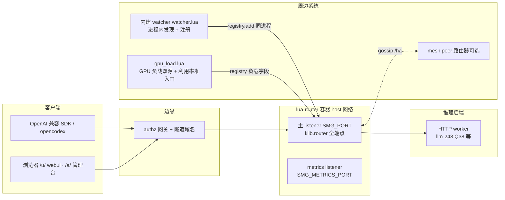
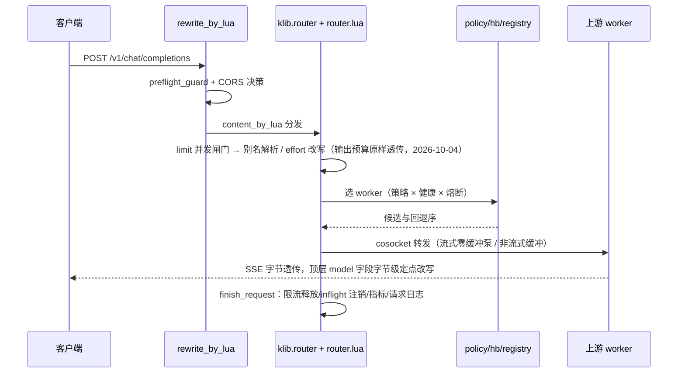

# lua-router 系统架构与代码框架

> 本文是架构总览：运行时模型、请求生命周期、模块地图、共享状态、策略子系统、周边集成、
> 部署形态与测试框架。计数对应 2026-10-06 当前 main 树（`66a891f`）：`lualib/` 下 **75 个 Lua
> 文件 / 34 608 行**（七个域拆成 facade + 子模块，见 §3）、单测 13 个文件、契约 691 项 / 24 段、
> **22 门禁全绿**（锚点日志 `/data/tmp/lr-gates/gates-20261006-051452.log`，tier=full）。
> 本轮拆分的设计契约与执行记录见 [refactor-arch-2026-10-05.md](refactor-arch-2026-10-05.md)；
> 裁剪判定与执行记录见 [scope-trim.md](scope-trim.md)；已删平面的描述在 git 历史，本文只描述现状。
>
> **本文引用代码的口径：文件 + 函数名，不钉行号。** 2026-10-05 的拆分让旧树里所有「文件:行号」
> 引用全部漂移（同一个行号在拆分前后指向不同函数），此后不再写行号。

## 0. 定位与全景

lua-router 是 Rust 网关 smg（源码在上游 llm-router 仓库的 gateway/）的 **OpenResty/Lua 等价重写**：
一个面向 LLM 推理后端的路由网关，负责多 worker 选路、流式透传、健康检查、熔断、并发限流、
观测与控制面。它跑在 authz 同源镜像（OpenResty 1.31 + LuaJIT）上，不依赖任何原生扩展。
对外行为以 Rust 版为契约基准做行为对拍（当前 24 段 691 项，裁剪前 841 项；新增的 `caps` 段钉每服务容量）。

## 1. 运行时模型

### 1.1 进程模型与 worker 数

- OpenResty master + N worker（`NGINX_WORKER_PROCESSES`，缺省 auto）。
- **两个例外把 worker 钉成 1**：cache_aware 策略（一致性树是 per-process 表，多 worker 会把亲和率
  1.000 摊薄到 0.625）与 mesh 开启（成员表在进程内存）。entrypoint 在这两种形态且未显式给
  worker 数时自动收敛，运维显式覆盖会得到文档化的衰减行为。
- 多 worker 下其余功能全部正确：所有跨请求状态都放共享字典（§5），per-process 的只有 cache_aware
  树、bucket 计数表和 mesh 成员快照。

### 1.2 监听面

| 监听 | 开关 | 缺省 | 内容 |
|---|---|---|---|
| 主 listener | `SMG_PORT` | 30000 | 全部 HTTP 端点：推理/控制/公开/UI（`/u/`、`/a/`、`/_ui/*` 别名）/ha；TLS 由 `SMG_TLS_CERT_PATH`+`SMG_TLS_KEY_PATH` 就地加密（替换明文监听，与 Rust rustls 同形） |
| metrics | `SMG_METRICS_PORT` | 29000 | 只出 `/metrics`（真实 Prometheus 文本）+`/health`；保持明文；`0` 关闭后 `/metrics` 仍在主监听上 |

### 1.3 配置渲染

`docker-entrypoint.sh` 是唯一的启动路径：校验 env → envsubst 渲染 `conf/nginx.conf.template` →
`openresty -t` 语法门 → exec。渲染注入点：`METRICS_EXTRA` / `TLS_SERVER_EXTRA`（可选监听整块）、
`LR_HTTP_INCLUDE` / `LR_SERVER_INCLUDE` / `LR_UI_CONF`（运维追加片段与 UI 路由，`off` 关闭）、
`AUTHZ_DNS_RESOLVER`（域名 worker 的 resolver）。env 命名三层双认：`SMG_*`（Rust CLI 同名语义）、
`LMR_*`（UI agent 生态）、`LR_*`（测试专用），entrypoint 在 init_by_lua 快照环境前完成归一
（如 `SMG_UI_DIR`→`LMR_UI_DIR`）。

### 1.4 镜像与静态资产

`FROM authz:latest`；构建期 COPY 全部 lualib/模板/entrypoint/ui.conf，把 `ui/`（原版 llama.cpp
webui 静态包 + `ui/admin/` Quasar UMD 管理台四页）放进 `/usr/local/share/llama-ui`；构建期跑一次
`openresty -t`，坏配置进不了镜像。mime.types 在 http 块 include，静态文件按正确 Content-Type 发出。
管理台的**规范页面入口是 `/a/`**、webui 是 `/u/`（2026-10-05 入口迁移）：旧入口 `/_ui` 与
`/_ui/admin/` 各自 302 过去，`/_ui/*` 的精确 API 别名全部保留、`/_ui/` 静态同时双活，
当前 bundle 里硬编码的 `/_ui/...` 路径不受影响。

## 2. 请求生命周期（HTTP 推理面）

关键不变量：

- **推理体字节透传**：除顶层 `model` 等受管字段用 `set_top_field` 精确扫描替换（不整表重编码，
  嵌套字段不受影响、数组保形），其余字节原样进出；流式响应不缓冲。token 核算对 usage 帧的
  注入/剥除是唯一的帧级编辑，有 `MAX_SSE_FRAME` 上界。
- **重试只在 Lua 层**：换 worker 重试、退避与 jitter、每 attempt 独立 cosocket；熔断计数在共享
  字典原子完成（跨 worker 进程一致）。
- **转发头纪律**：请求侧白名单转发（含 `x-request-id-*` 前缀规则）；响应侧删 hop-by-hop /
  `content-encoding` / `host` / `content-length` 并自行分帧；上游统一
  `Accept-Encoding: identity`。重试状态集 408/429/500/502/503/504，4xx 不计熔断罚则。
- **`/v1/responses` 纯透传**：会话存储平面已删，该端点只做选路、转发与非流式 2xx 的请求侧
  元数据回填（七字段），不入库。
- **log 阶段兜底**：客户端中途消失时唯一还会执行的是 `log_by_lua`，inflight 注销在这里兜底。

## 3. 模块地图

全部在 `lualib/resty/luarouter/`。2026-10-05 的拆分把 7 个 2000+ 行的大文件变成「**facade +
同名子目录**」：facade 只做 `require` 与 `_M` re-export（并预登记 `package.loaded`，让子模块
加载期能回指同一张表），实现逐字住在子模块里。**对外契约仍是 facade 的 `_M` 名册**——各 conf 的
`*_by_lua`、单测的 `package.loaded` 换桩、五方借用点全部按原名从 facade 上取，逐名保留。

`find lualib -name '*.lua' | xargs wc -l` 实测 **75 个文件 / 34 608 行**；单测对应
`test/unit/test_*.lua`（**13 个文件**；门禁跑 luajit 12 个 + resty 4 个口径，其中
tree / policies / hash 双口径各跑一次）。

### 3.1 七个拆分层（facade + 子模块，行数 wc -l 实测）

| 域 | facade（行数） | 子模块（一句话职责 · 行数） | 被谁接线 |
|---|---|---|---|
| **router** | `router.lua`（364）：klib 路由表 `build()` + `handle()` + server 级预检 + 全量 re-export | `jsonutil`(1000) 顶层精确改写族（`set_top_field` / `rewrite_model` / `merge_top_object` / `patch_response_metadata`）+ DP rank 注入 + 路由文本抽取 + usage + SSE + 会话指纹 `respond`(318) 错误应答 / CORS / request id / 请求头与标签白名单 `profiles`(305) config_store 之上的 profile 读层缝：`profile_model_group` 与两条恒 nil 停用缝 `profile_policy_name` / `profile_effort_value` `candidates`(710) **热路径**：`policy_for` + `candidates_for` 门序（健康→白名单/绑定→模型许可→容量硬排除(full)→组门→**绿灯优先裁剪**）+ `group_key_name` / `group_policy_hint` + card_key 族 `pump`(189) cosocket 泵（`connect_target` / `read_response_head` / `send_attempt` / `discard_body` / `read_response_body`） `forward`(878) streaming 泵 + 重试环 + `forward` 主循环（`lr_bound_model` → `rewrite_model` 的转发名在此落地，整组一致拒绝的 503 文案、**全池到顶的 429** 与显式 pin 读 `why.stepped_aside` 也在此） `inference`(526) 推理面（别名解析、effort 三层继承、`output_budget_of` 纯读、两条恒「无改写」的 ctx 空壳）+ 公开面 health 族 `models_api`(969) `/v1/models` 合成（`models_handler` / `advertise_real_model` / `advertise_virtual_entry` / `fill_model_fields` / `inject_virtual_models` / `resolve_model_caps` / `common_acceptance` / `declared_context_limit`）+「只广告虚拟入口」开关 + server_info `metrics_ep`(430) metrics 聚合渲染 + engine_metrics / model_info（load-safe：entrypoint 独立进程直调） `control`(483) 控制面（workers CRUD / flush_cache / v1/loads / model-map）+ 观测与 mesh handler + `preflight_guard` `reqlog`(167) `log_inference_request` 组装一条 RequestRecord + `finish_request` 统一收尾 `host`(45) 进程级惰性访问器 `cfg()` / `limit()` / `store()`——**不进导出契约**，只被子模块 require | conf 三处 `*_by_lua` 只取 `preflight_guard` / `handle`；`ui.lua` 运行时硬依赖 `set_top_field` / `do_chat` / `do_completion` |
| **config_store** | `config_store.lua`（132）：require + 逐名 re-export | `lexicon`(355) helper、词表、JSON 形状小工具、对端模块惰性取用 `env`(117) `ENV_NAMES` 名册 + `capture_env` / `env` + `LMR_UPSTREAMS_FILE` 种子 `profiles`(815) 池 / 候选 / 绑定 / 组装配：`build_target_group` / `target_group_of` / `build_context_window` / `profile_from_entry`（停用的 per-alias `policy` / `effort` 各在此打一条 warn）+ 两条别名链守卫（`assert_no_alias_chain`） `upstreams`(704) 声明层校验与脱敏 + `upstream_drifts` / patch / `reconcile_upstreams` `snapshot`(814) 空快照语义 + `sync_virtual_view` / `new_card` / `snapshot_of` / `cfg_from_document` / `cfg_from_env` + 配置期校验 `validate_declared_context_windows` `persistence`(540) **硬边界：全模块只有本文件碰 shdict / 后端 / 文件 IO**（三层读写 + CAS 冲突 + `persist` + `migrate_once` + 四枚 revision token 读点） `readers`(542) `current` / `ctx_cap` 族 / `virtual_ctx_cap` / 模态 / policy 热路径读 / `policy_document` / 档位三层查表 `mutators`(452) `apply_*` 家族 + 整表写 + `profile_policy` / `profile_effort`（活着的死 reader） `httpc`(155) `raw_request`（唯一生产读者是 props 的 /props 代理） `handlers`(389) watcher 桥 + `document` / `models_document` + 10 个 `handle_config_*` | router / init / policy / props / ui / observability / router-host |
| **registry** | `registry.lua`（174） | `keys`(355) `lr_workers` 键格局（含 `gu:`）+ shdict 懒解析 + 锁 + worker id + 名单 + mesh 写钩子 `url`(118) url 规范化与拨号助手 `caps`(647) 上游能力采集（自包含纯域） `records`(1145) 规格解析 + models 助手族 + `add` / `remove` + 读出视图 + `info`（含 `load_state` 与三个上限、两个实测读数）+ `candidate_allows_model` + `patch_record` `health`(273) 健康位与熔断（open→half_open 唯一恢复 CAS） `loads`(638) 负载折叠 + **每服务容量判定**：`cap_limit` / `util_limit` 两把归一尺子、私有 `capacity_verdict`（唯一判定体）、公开 `capacity_state`（**三态 idle/busy/full/nil**）与 `capacity_exclusion`（只对 full 返回排除）、`lo:` / `pw:` / **`gu:`** 三个读数的读写（`set_gpu_util` / `gpu_util`；读数未知→不排除，`set_gpu_util` 拒负值/NaN/±inf、只在上方夹到 1） `discovery`(808) 探针与覆盖度（`probe_advertised_entries` / `refresh_models` / `model_caps` / `record_model_caps`）+ PUT update + 元数据发现 + DP 展开 + 作业队列 + 种子 | router / hb / mesh / watcher / gpu_load / config_store / policy / props / observability / init |
| **watcher** | `watcher.lua`（65） | `env`(492) 26 枚 `SMG_WATCHER_*` + URL 规范化 + 自端口 `modelmap`(251) model-map 解析与 effective / apply `probe`(176) 严格探针 `classify` / `probe_verdict` 三档判定 `discover`(784) 三源发现纯层 + docker `unix_get` / `collect`（**DENY_PORT 只在 proc 扫描分支生效**，就在 `collect` 的 deny 装配处） `ledger`(229) 台账 `reconcile`(759) **内部不许再拆**：守卫的唯一判定点 + 分档摘除 + 单轮保险丝 `live`(514) live 入口 + `make_fetch` / `probe_pool` + registry 适配 + run_pass / tick / start | init 定时器（worker 0 + lr_locks 单飞）、router/control、config_store/handlers、config.lua、gpu_load/seams |
| **gpu_load** | `gpu_load.lua`（80） | `parse`(765) exposition 解析族（负载 `max_gauge` / 功率 `max_power_watts` / **利用率 `util_fraction` + `util_by_card`**，三份 gauge 名册 + `DEFAULT_UTIL_QUERY`） `cards`(848) 卡归属与折叠（**四路**功率口径 `assign_power` + **四路利用率口径 `assign_util`**（认不出卡回退整机 max 并计 fallback）、`host_card_utils` / `util_fold`、`util_config`） `prom`(209) Prom 客户端 `seams`(384) live seams（`default_write` / `default_write_power` / **`default_write_util`**）+ effective_load + warn_dedup `runpass`(818) `run_pass` 主循环（**负载 / 功率 / 利用率三通道** stats 字段口径单点定义 `new_stats`） `export`(304) 指标导出（三族）+ 定时器 | hb 定时器挂载 |
| **mesh** | `mesh.lua`（59） | `crdt`(1368) **不拆**：时钟 / LWW / 版本向量 + 成员表 + 分区检测 + `observe_worker` + 快照合并（幻影键修复的正确性依赖这些同域） `wire`(151) 协议编解码 `rate`(127) 全局限流窗口 `handlers`(425) `/_mesh/internal/*` 四条 + 13 条 `/ha/*` `sync`(481) cosocket `http_request` + `sync_with` + `ROUTES` / `dispatch` + `SMG_MESH_*` 装配 + 进程内单例 | init 定时器、router/control、registry/keys |
| **observability** | `observability.lua`（1328）：写侧原语（counter / observe / gauge + 键文法）+ `record_*` 登记点 + **HELP 权威表** + `prometheus_text`——**与导出器同域不拆**（键文法是隐式契约，契约门只测最终文本） | `inflight`(246) 在飞年龄 tracker（lr_stats 的 1024 定长槽） `logstore`(600) 请求日志环形缓冲 + 查询 DSL + `/_ui/logs` 三 handler + `stats()` | router / policy / hb / limit / init / store_dispatcher / gpu_load-export / watcher-live / registry-health |

### 3.2 未拆的单文件模块

| 模块 | 行数 | 职责 | 被谁接线 |
|---|---:|---|---|
| `hash.lua` | 964 | BLAKE3 环位（与 Rust 逐位兼容）、ketama 序、粘滞键 | consistent_hashing / prefix_hash |
| `policy.lua` | 901 | 策略分发（random / round_robin / power_of_two / manual 内联于此）、policy hint、cache_aware 逃逸/快照 | router / init / registry-discovery / watcher-live |
| `policies/*.lua` | 2314（6 文件） | tree（基数树+粘滞）/ cache_aware / bucket / consistent_hashing / prefix_hash 五个实现 + utils | policy |
| `init.lua` | 547 | fork 前接线：env 快照、hb / watcher / mesh / 负载定时器（worker0 + lr_locks 单飞）、on_log 兜底 | nginx `init_by_lua` / `init_worker_by_lua` |
| `hb.lua` | 417 | 健康巡检定时器 + 熔断计数 + /v1/loads 扇出 + gpu_load 定时器挂载点 | init 定时器、router、registry-discovery、watcher-live |
| `config.lua` | 394 | env → 配置对象（含 watcher 子配置的可用性探测） | init |
| `ui.lua` | 348 | `/_ui` 与 `/u` 的 API 别名 handler 族、`/props` 与根挂载的 webui 端点 | conf/ui.conf include |
| `httpc.lua` | 181 | **本轮新增的公共传输库**：cosocket 连接池 + HTTP 原语（自旧 registry 的 E 块提升）。registry 保留 re-export，router / config_store / hb / mesh / watcher / gpu_load 的既有借用点全部不动 | 只有 `registry.lua` require 它，其余经 registry 按原名借用 |
| `props.lua` | 225 | `/props` 快照与引擎代理；`with_ctx` 是 `ctx_cap`（模型卡 `ctx` / 平铺 `model_ctx`）唯一的生产读者，只换回显的 `n_ctx` / `n_ctx_train`，不参与任何转发字节 | ui.lua、config_store/readers |
| `limit.lua` | 209 | 全局并发闸门 + 排队（shdict 计数） | router（经 router/host）、init、observability |
| `store_dispatcher.lua` / `store_file.lua` / `store_sqlite.lua` / `store_postgres.lua` | 328 / 227 / 318 / 189 | 配置后端分派、镜像文件、sqlite、postgres | config_store/persistence |

依赖方向自上而下单向：conf → init → router →（policy / registry / hb / limit / watcher / gpu_load /
mesh / config_store / observability）→ policies。除 mesh 成员表与 cache_aware 树外，模块间不共享
进程内可变状态，跨请求状态一律走 shdict。

**接线完整性的最终判官是 contract/e2e 门，不是静态审计。** 本轮拆分后的跨模块接线遗漏
（`router/pump.lua` 漏 export `send_attempt` / `discard_body` / `read_response_body`，
`router/forward.lua` 在加载期捕获到 nil，转发一律 500）就是被 **contract 门**抓获的
（修复 `48b7f6a`）。「逐字搬家」的静态审查看得出内容错不错，够不着「模块表里少一个名字」这类
加载期缺陷——facade 的 re-export 名册只能靠真跑请求兜底。

## 4. 平面清单（主 listener 端点域）

| 平面 | 端点 | 鉴权 |
|---|---|---|
| 推理数据面 | /v1/chat/completions、/v1/completions、/v1/embeddings、/v1/rerank、/v1/classify、/v1/responses（纯透传+元数据回填）、/generate、/v1/models（HEAD 镜像） | 开放 |
| 控制面 | /workers CRUD（幂等 id）、/flush_cache、/v1/loads、/model-map | 开放（信任边界=网络，见 §7） |
| 公开面 | /health、/liveness、/readiness、/server_info、/model_info、/engine_metrics、/health_generate | 无 |
| UI 面 | 页面入口 `/u/`（原版 webui）与 `/a/`（管理台）；旧入口 `/_ui`、`/_ui/admin/` 各 302 到新入口，`/_ui/*` 精确 API 别名（config / logs / stats / props / v1/* 全家）与 `/u/*` 同名别名**全部保留**，`/_ui/` 静态双活；另有原版 webui 所需端点的根挂载：`/props`、`/slots`、`/tools`、`/models/load`、`/models/unload`、`/models/sse`、`/v1/stream`、`/v1/streams/lookup`、`/v1/chat/completions/control`、`/properties`（全部复用 ui.lua 现有 handler） | 开放 |
| HA | /ha/* 13 条 + /_mesh/internal/* 4 条（mesh.ROUTES 共 17 条） | 缺省整面 503；开启后无鉴权，mesh 端口只能开在可信网络 |
| 观测 | /metrics（主监听 + 独立 metrics 监听） | 无 |
| 未实现 | /wasm 三条固定 501（TODO，见 [todo-deferred.md](todo-deferred.md)） | — |
| 404 sink | 任意未注册路径（含已删的 conversations/tokenize/parse 等整面） | `{"error":{...not_found...}}` |

## 5. 共享状态（8 个 shdict）

| 字典 | 大小 | 内容 | 写者 |
|---|---|---|---|
| lr_workers | 2m | worker 记录（URL/模型/覆盖度 `models`+`models_verified`/健康/熔断/元数据（含 watcher 补的 `labels.gpu`）/负载字段/**三个上限 `min_concurrency`+`max_concurrency`+`max_gpu_util`**/来源 `discovery`）与数值键 `lo:`（本网关在飞）/`xl:`/`sl:`（外部负载，打分用）/**`gu:`（该 worker 自己那张卡的 0..1 GPU 利用率，毫整数，TTL，唯一写者 gpu_load 的利用率通道；容量准入门读它）**/`pw:`（毫瓦功率样本，TTL；**2026-10-06 起保留为纯观测，不再参与任何容量判定**）/`xany`（有样本标志）/`mp:`+`mpok:`（覆盖度探针预算），registry 每次读写整表 JSON。上限一律随记录 JSON 与 `luarouter_config` 快照走（组信息亦然）| registry/hb/watcher/mesh/gpu_load |
| lr_policy | 20m | 策略态：manual 粘滞键、routing key 计数、cache_aware 树快照 | policy |
| lr_stats | 5m | 计数器/直方图/inflight 年龄槽表（1024 定长槽） | observability |
| lr_request_log | 20m | 请求日志环形缓冲（/_ui/logs 与 SSE 源） | router log 阶段 |
| lr_locks | 1m | 跨进程互斥（巡检/采样/watcher 定时器的单飞锁） | init/hb/watcher |
| lr_watch | 64k | watcher 运行态（ledger/宽限期记账） | watcher |
| lr_limit | 64k | 全局并发闸门计数 | limit |
| luarouter_config | 1m | config_store 热配置快照 | config_store |

一致性代价与收益：跨进程原子（熔断/限流/注册表）换每请求 shdict 往返；当前每请求 shdict 往返
66 次（出厂形态 44 次）是非流式 CPU 回退的主因（见 [parity-cpu-ablation.md](parity-cpu-ablation.md)，
P1+P2 ≈45–65%）。

## 6. 策略子系统

选择流：`router/inference.lua` 的 `route_inference` → `policy.select(policy_name, ctx)` → 策略实现从 registry 候选里
挑目标；`hb` 先过滤不健康/熔断中的 worker；失败回退序在 router 层（重试换 worker）。策略可经
`/_ui/config` 热切换（全局 + per-model，免重启，见 [gap-routing-dyn.md](gap-routing-dyn.md)）。

候选集层面先于策略的门，按 `router/candidates.lua` 的 `candidates_for` 里的实际顺序：
**健康与池成员**（`registry.is_available`）→ **白名单/绑定**（legacy `workers` 与 `candidates` 并存时取交集）
→ **模型许可**（IGW 只收窄未绑定候选，显式绑定不受探针否决）→ **每服务容量硬排除**
（`registry/loads.lua` 的 `capacity_exclusion`，**只在 `capacity_state == "full"` 时命中**）→ **组门**
（同函数尾部，只作用于组条目；此时 IGW 那道门整个让位，条件里多了 `and not group`）→
**绿灯优先裁剪**（组门与绑定都生效之后，落地段之前）：存活者里有 `idle` 就只把 idle 子集交给策略，
黄灯让位（`why.idle` 计数、`smg_worker_capacity_preferred_idle_total`）；**没有任何 idle 时数组一字不动**，
黄灯继续接活直到触自己的上限。让位是**裁剪不是排除**（不计 `why.capped`、被裁剪的成员仍可被显式 pin
经 `why.stepped_aside` 命中），只认 `"busy"` 让位——`nil`（未声明上限 / 问不到）不许被挤走。
判定与硬排除同在一个函数体内，`policies/` 零改动。容量那条必须是排除而不是打分，因为 cache_aware 命中亲和时
按 URL 直取 tenant、完全不看负载——「超限但粘人」的 worker 会把这条规则想搬走的流量原样留下；唯一不会与之
打架的位置就是让它根本进不了候选数组。见 [gap-worker-caps.md](gap-worker-caps.md) §1 / §4。

路由文本抽取契约（策略稳定键的来源）：messages 按 system/user/tool/developer 序拼 content、
assistant 含 `reasoning_content`、数组 content 只取 `{type=text}` 片段以单空格拼接、
无文本 → nil；completions 面用 `prompt` 空格 join。

| 策略 | 语义要点 | 与 Rust 对拍结论 |
|---|---|---|
| cache_aware（缺省） | 前缀亲和一致性树 + 负载逃逸（abs/rel 阈值）+ 快照驱逐 | 亲和/逃逸方向对齐；多 worker 亲和率衰减两侧同源 |
| consistent_hashing | BLAKE3 环位逐位兼容，摘节点 unchanged/collateral 比例一致 | 逐 key 落点完全相同 |
| prefix_hash | 对话前缀哈希粘滞（Lua 按字符数，Rust 按 token 数） | Rust HTTP 面 tokens 恒 None → 恒 503（Rust 侧缺陷），Lua 单边不变量钉住 |
| bucket | 环分段均衡，失衡改选最小桶，gap=floor(4096/N) | Rust CLI 拒绝该策略；多进程下失衡保护被摊薄（已钉测试） |
| power_of_two | 双随机候选取低载（GPU 负载双源接入后即刻受益） | Rust 无 /v1/loads 时退化为随机（Rust 侧缺陷），Lua 用自身 inflight |
| random / round_robin / manual | 均匀（χ² 双检）/顺序/粘滞绑定+回切 | 一致 |

per-model policy hint：worker 注册元数据可携带策略提示（`metadata.policy`），`policy_for` 按
模型解析——这是 P2 CPU 项的来源之一（见 parity-cpu-ablation.md）。

### 6.1 虚拟入口一棵树（用户裁定 2026-10-02）

组模式（`profile.explicit_targets == true`，组读数由 `router/profiles.lua` 的 `profile_model_group` 给出）下
**策略实例的 key 用入口名而不是任一成员模型名**（`router/candidates.lua` 的 `policy_for` 组分支，键由同文件的
`group_key_name` 给出）。理由：`policies/` 一律按 worker 的 (pool, model) 分桶——cache_aware 的
`make_tree_key`、consistent_hashing/prefix_hash 的环键、bucket 的桶键都读 `policies/utils.lua` 的
`worker_model_id`——一个跨两个模型的入口会裂成两棵互不相见的树，
亲和与负载逃逸就只在各自模型内成立、跨组失效，而这正是本功能存在的意义。落法是候选装配处把整组
盖成同一个池：`router/candidates.lua` 的 `candidates_for` 在组条目上写 `record.model_id = 入口名`，
`policies/` 依旧零改动（本轮拆分时这段连同注释逐字搬进了该文件）。
hint 来自整组的活成员（同文件的 `group_policy_hint`），且第四参数必须是布尔 `live > 0`——
把计数直接递给 `policy.for_model` 会让「最后一个 worker 走了就丢弃该实例」永久失效。

per-alias 的 `policy`/`effort` 停用之后，「给这个入口换策略」只剩 `model_policies` 一条路，而策略实例
的 key 恰是入口名，所以入口名也进 `config_store/readers.lua` 的 `policy_document`（补进行集在同函数内）——否则路由
策略页永远列不出入口那一行，最关键的调度开关反而没有 UI 入口。

## 7. 周边集成

| 系统 | 方向 | 机制与注意 |
|---|---|---|
| 内建 watcher（原 llm-watcher，已合并） | router 进程内定时器 | worker 0 三源发现（targets/dockersock/proc）、严格 `/v1/models` 探针、十条守卫、宽限期；独立容器已退役。探针确认不可用按分档摘除：确定性否定当轮摘、传输层未知攒 `SMG_WATCHER_PROBE_FAILURES`(2) 轮再摘、单轮摘除超 owned 一半降级为只 warn。测试 mock 仍会短暂入池，根治需端口黑白名单（见 [gap-watcher-merge.md](gap-watcher-merge.md)） |
| GPU 负载源 | worker/监控 → registry | `gpu_load.lua` 两路负载（抓 worker `/metrics` 的 DCGM 类指标 + 远程 Prometheus 查询，写 `xl:`）+ **两条搭载通道**：绝对瓦特写 `pw:`（**纯观测**，2026-10-06 起不再喂容量）与**逐卡 GPU 利用率写 `gu:`**（准入门的数据源；`assign_util` 四路口径，认不出卡时回退整机 max 并计 `lr_gpu_load_util_fallback_total`，不做静默降级）。这类**转发路径上的**探测失败只损失选路精度、不参与摘除判定（摘除分档只属于上一行的 watcher 严格探针，见 agent-handover.md §4），详见 [gap-gpu-load.md](gap-gpu-load.md) §9 / §10 |
| 每服务容量上限（2026-10-01 立项；**2026-10-06 三态重设计**） | 操作员配置 + 两个实时读数 → 选路 | 三个字段：`min_concurrency`（并发调度**下限**，缺席=1）/ `max_concurrency`（**上限**，≤32）/ `max_gpu_util`（GPU 利用率**上限**，0..100；**0 是最严档不是清除**，清除用负数）。`registry.capacity_state` 一处判 `idle`/`busy`/`full`/nil：full = 在飞 ≥ 上限 **或**新鲜 `gu:` ≥ 利用率上限；`capacity_exclusion` 只对 full 命中，在 `router.candidates_for` 装配候选时**硬排除**（即使 cache_aware 亲和命中也迁走）；有 idle 时黄灯让位（裁剪、非排除）。三 cap 全缺席 = 无门 = 零 shdict 读、行为逐字节同旧版。不摘 worker、不改健康。**利用率读数未知 → 不排除**（`gu:` 缺席=未知≠0，监控故障只许损失精度不许损失容量）。全池都到顶时答 **429** `no_available_workers`+「No available workers (N at their concurrency or GPU-util limit)」（用户裁定 2026-10-06：容量到顶不是服务不可用），熔断/不健康/组不服务保持 **503** 原句。指标 `smg_worker_capacity_excluded_total{reason="concurrency_max|gpu_util"}` 与 `smg_worker_capacity_preferred_idle_total`（Lua 独有超集，Rust 无此能力）。`max_power_w` 退役（warn 一次并丢弃、不回显、判定不读），功率采集留作纯观测。见 [gap-worker-caps.md](gap-worker-caps.md) |
| 虚拟服务入口 1 对多（2026-10-02 语义反转；2026-10-04 改输出预算口径） | config → 选路与声明 | 虚拟名是**对下游暴露的服务主入口**，`targets[]` 映射一组实际模型（1..N，可来自不同上游），由**调度策略在组内选路**；**策略 key 用入口名**，一入口一棵树（`policies/` 零改动），亲和与逃逸在这一组实际模型之间成立而非按模型名分裂。条目级只允许配 `context_window`：它是**对外声明的上下文总窗口（输入+输出）**，只让客户端据此决定何时压缩，**不参与任何 max_tokens 计算、不改写任何输出预算**（用户裁定 2026-10-04，旧「统一钳制」口径已废止，理由与故障形状见 gap-virtual-models.md §4.2）。引擎真实能力记在模型卡 `context_limit`（平铺 `model_context_limit` / env `LMR_MODEL_CONTEXT_LIMIT`），配置期校验 `config_store/snapshot.lua` 的 `validate_declared_context_windows` 要求声明值**严格小于**组内各卡片该读数的最小值，否则拒绝保存；组内无读数则不校验。per-alias `policy`/`effort` 停用（仍往返、热路径不读），改由 `model_policies`（按入口名）与模型卡承担。旧形状（`{model,target}` / candidates-only / env）由 `explicit_targets` 旗标保证逐字节不变。实现锚点（文件 + 函数名）：`router/profiles.lua` 的 `profile_model_group`、`router/candidates.lua` 的 `candidates_for` 组门、转发名取 `worker.lr_bound_model` 并在 `router/forward.lua` 的 `forward` 里交给 `router/jsonutil.lua` 的 `rewrite_model`（同函数顺手写日志字段 `ngx.ctx.lr_forwarded_model`，日志行组装在 `router/reqlog.lua` 的 `log_inference_request`）、条目级 `context_window` 解析 `config_store/profiles.lua` 的 `build_context_window`（由同文件的 `profile_from_entry` 调用）、输出预算只读探针 `router/inference.lua` 的 `output_budget_of`；已被废止为恒「无改写」空壳的 `apply_ctx_cap` / `entry_ctx_cap`（同在 `router/inference.lua`）与只读用途的 `config_store/readers.lua` 的 `ctx_cap` / `virtual_ctx_cap` 都还在，热路径无调用者。见 [gap-virtual-models.md](gap-virtual-models.md) |
| 管理台页面合并（2026-10-02；页面入口 2026-10-05 迁到 `/a/`） | 操作员 → /a/ | **服务池 = 运行态池 + 声明层同页**：`ui/admin/workers.html` 把 `GET /workers`（3s 轮询）与 `GET /_ui/config` 的 `upstreams` 段（20s 轮询）按规范化 URL（折叠尾斜杠 + 大小写）全外合并，一个地址一行；原「远程服务/服务接入」（`ui/admin/upstreams.html`）缩成重定向占位以保住旧链接并消灭「同一份声明层被两个页面各自整表替换」的分叉。上限的**事实来源是声明层**：`cap_owner === 'declared'` 当且仅当有声明且（未入池或池行 `discovery === 'config'`）——因为 `config_store/upstreams.lua` 的 `reconcile_upstreams` 只 patch config 行，「同地址被 watcher 抢先认领 → 声明惰性」是稳态；这类行的**运行态编辑入口整体隐藏**（不止上限），理由是同文件的 `upstream_drifts` 连 priority/cost/labels 一起比较并写回。这类行打三态徽章 `cap_drift`（等自愈·与声明不一致）/`cap_shadowed`（声明管不到这行）/`key_inert`（声明里的 api_key 此刻没下发）。导航按使用频度重排为**模型管理 → 服务池 → 路由策略 → 日志**（`ui/admin/app.js` 的 `pages` 常量），历史锚点 `#upstreams.html` 经同文件的 `legacyPages` 落到合并页；模型页改名**「模型管理」**（`ui/admin/models.html`：虚拟模型入口页，也是全仓最常用的配置页，虚拟模型卡片排在页面最上面；2026-10-05 起虚拟条目改成「条目列表 + 点击编辑弹表单」，保存链路仍是整表替换 + 自键定位）。**控件纪律**：本仓 vendor 的 Quasar UMD（`ui/admin/vendor/quasar-umd.js`，内标 Vue 3.5.41 / Quasar 2.26.0）里 QToggle 与 QOptionGroup 都不经 BaseField 渲染，实测给它们写 `:hint` 不会生成 `.q-field__bottom`，说明文字**只能并进 `:label`**（服务池声明对话框的两个 toggle 就是按这条做的）。见 [gap-pool-merge.md](gap-pool-merge.md) |
| mesh peer | router↔router | `SMG_MESH_PEERS` 种子 + gossip 同步 worker 视图；身份统一由 sync_with 并键（幻影键已修，mesh_two 门钉住）；`/_mesh/internal/*` 无鉴权，只能开在可信网络 |
| authz 边缘 | client→router | 生产经隧道域名时 authz 闸门加会话登录或 x-api-key；网关自身零鉴权，全部端点开放 |

## 8. DP（data parallel）展开面（HTTP）

多 GPU 后端（dp_size>1）由 registry 展开成 `<base>@<rank>` 候选：`expansion_plan` 等纯决策函数
在 registry 内联（原属 discovery 模块，裁剪时迁移）；`router` 在转发前往请求体写顶层
`data_parallel_rank`（已存在则原位覆盖）。每个 rank 独立健康计数与熔断。`/server_info` 拉取失败
不展开（保持单条记录，`MAX_DP_ATTEMPTS`=20 后落 dp_size=1）；展开发生在健康探测 2xx 之后，
注册后的首个巡检周期内仍是单条 base 记录。31 项断言在 e2e_stateful。原 gRPC/PD 分离面已按
scope-trim 删除，git 历史可恢复。

防二次展开三分支：带 `dp_base_url` 的记录（已是 rank）、url 自带 `@<数字>` 后缀、`dp_size`
已定的 base 都不再展开——覆盖「rank 被删后手工 POST 回来」的场景。

## 9. 部署形态

| 项 | 值 |
|---|---|
| 镜像 | 本仓构建 `lua-router:latest` / 生产 tag `lua-router:8800-YYYYMMDD-N`（FROM authz:latest） |
| 编排 | /data/app/lua-router/docker-compose.yml：host 网络、unless-stopped、docker.sock ro 挂载、配置持久化 /data/app/lua-router/config |
| 生产实例 | 235.t 容器 lua-router-8800，主端口 8800，metrics 29000 |
| 回滚 | `docker stop lua-router-8800 && docker start llm-router-8800`（Rust 版容器已停保留） |
| 已知运维点 | watcher 端口扫描会把测试 mock 短暂注册进生产池，跑完门禁后按 `GET /workers` 清一次 |

## 10. 测试与质量框架

`test/final_gates.sh` 是唯一入口（GATE_TIER=quick|full 缺省 quick、SKIP_ENV/GATE_ONLY/KEEP_GOING，
串行硬门，**不可并发**——host 网络 + 固定容器名前缀会争用；发版/计数/生产替换必须 full 档）。
22 门（锚点日志的运行序）：build、conf、unit、contract（24 段 691 项）、probes、
e2e_stateful、e2e_policies、e2e_ui_bridge、e2e_errors、e2e_effort、head_routes、mesh_http、
e2e_policy_parity、e2e_token_accounting、e2e_gpu_load、e2e_routing_dyn、e2e_profiles、
e2e_caps、e2e_models_advertisement、e2e_watcher、mesh_two、e2e_tls_chain；逐门计数与覆盖见
README 基线表。`GATE_JOBS>1` 可把互不干扰的门并行跑（三门留串行），同一时刻仍只允许一份门禁
（脚本内 flock）。

方法论：契约=与 Rust 实例同请求逐字段对拍；策略=分布统计（χ²）+不变量+变异验证；e2e=真容器真
上游。对拍原始报告在 doc/parity-*.md 与 doc/real-eval.md（真实上游 18/18、prefix cache 命中
97–99%）。

## 11. 与 Rust 原版的关系（档位口径）

- **A 已等价（新范围内）**：推理/控制/公开/UI/观测/HA(mesh) 有契约或 e2e 钉死。
- **B 有意偏差**：404 JSON 体、错误方法 404 vs 405+Allow、CORS 覆盖面更宽、排队超时 429 vs 408、
  `/flush_cache`/`/v1/loads` 响应形状、`PUT` 同步生效等（全表见 README 已知限制索引）。
- **C 待行动**：非流式 CPU 回退修复（已定责 P1+P2）、TLS 入口预检（配对/缺中间证书）、mTLS、
  watcher 扫描污染根治。
- **D 用户指示 TODO（不实现）**：MCP、wasm（唯一口径 [todo-deferred.md](todo-deferred.md)）。

## 12. 演进索引

| 方向 | 入口文档 |
|---|---|
| CPU 回退修复（R0 重测→按嫌疑榜消融） | [parity-cpu-ablation.md](parity-cpu-ablation.md) §8 |
| TLS 入口预检路线 | [gap-tls-chain.md](gap-tls-chain.md) §5/§6 |
| 已删平面的恢复 | git revert 对应 trim(stepN) commit；设计记录在删除前的历史文档（git 历史） |
| watcher 测试 mock 污染治理 | [gap-watcher-merge.md](gap-watcher-merge.md) 偏差 13 |
