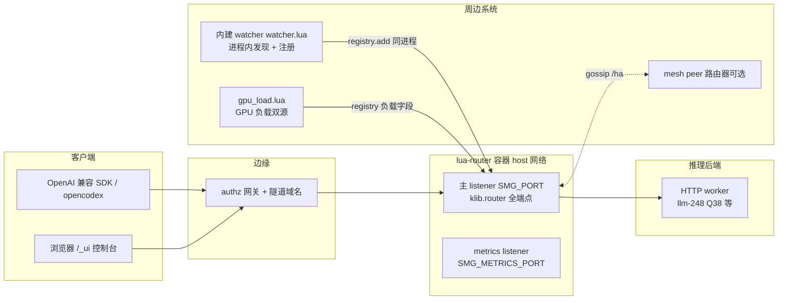
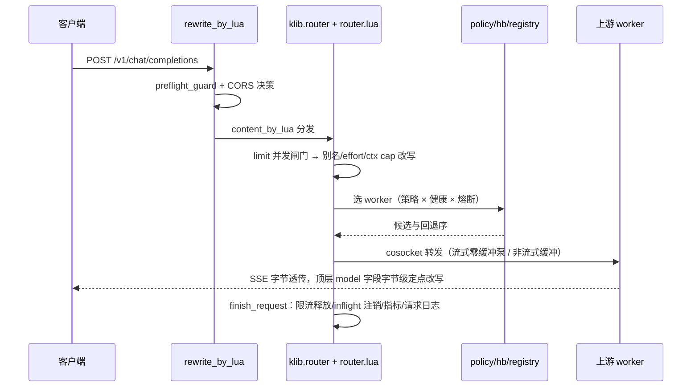

# lua-router 系统架构与代码框架

> 本文是架构总览：运行时模型、请求生命周期、模块地图、共享状态、策略子系统、周边集成、
> 部署形态与测试框架。计数对应 2026-10-01 当前 main 树：15 个 Lua 模块 + policies/ 6 文件 /
> 24 417 行、单测 10 文件、契约 650 项 / 23 段、21 门禁全绿（日志
> `/data/tmp/lr-gates/gates-20261002-030544.log`）。裁剪判定与执行记录见
> [scope-trim.md](scope-trim.md)；已删平面的描述在 git 历史，本文只描述现状。

## 0. 定位与全景

lua-router 是 Rust 网关 smg（源码在上游 llm-router 仓库的 gateway/）的 **OpenResty/Lua 等价重写**：
一个面向 LLM 推理后端的路由网关，负责多 worker 选路、流式透传、健康检查、熔断、并发限流、
观测与控制面。它跑在 authz 同源镜像（OpenResty 1.31 + LuaJIT）上，不依赖任何原生扩展。
对外行为以 Rust 版为契约基准做行为对拍（当前 23 段 650 项，裁剪前 841 项）。

## 1. 运行时模型

### 1.1 进程模型与 worker 数

- OpenResty master + N worker（`NGINX_WORKER_PROCESSES`，缺省 auto）。
- **两个例外把 worker 钉成 1**：cache_aware 策略（一致性树是 per-process 表，多 worker 会把亲和率
  1.000 摊薄到 0.625）与 mesh 开启（成员表在进程内存）。entrypoint 在这两种形态且未显式给
  worker 数时自动收敛，运维显式覆盖会得到文档化的衰减行为。
- 多 worker 下其余功能全部正确：所有跨请求状态都放共享字典（§5），per-process 的只有 cache_aware
  树、bucket 计数表和 mesh 成员快照。

### 1.2 监听面

| 监听 | 开关 | 缺省 | 内容 |
|---|---|---|---|
| 主 listener | `SMG_PORT` | 30000 | 全部 HTTP 端点：推理/控制/公开/_ui/ha；TLS 由 `SMG_TLS_CERT_PATH`+`SMG_TLS_KEY_PATH` 就地加密（替换明文监听，与 Rust rustls 同形） |
| metrics | `SMG_METRICS_PORT` | 29000 | 只出 `/metrics`（真实 Prometheus 文本）+`/health`；保持明文；`0` 关闭后 `/metrics` 仍在主监听上 |

### 1.3 配置渲染

`docker-entrypoint.sh` 是唯一的启动路径：校验 env → envsubst 渲染 `conf/nginx.conf.template` →
`openresty -t` 语法门 → exec。渲染注入点：`METRICS_EXTRA` / `TLS_SERVER_EXTRA`（可选监听整块）、
`LR_HTTP_INCLUDE` / `LR_SERVER_INCLUDE` / `LR_UI_CONF`（运维追加片段与 UI 路由，`off` 关闭）、
`AUTHZ_DNS_RESOLVER`（域名 worker 的 resolver）。env 命名三层双认：`SMG_*`（Rust CLI 同名语义）、
`LMR_*`（UI agent 生态）、`LR_*`（测试专用），entrypoint 在 init_by_lua 快照环境前完成归一
（如 `SMG_UI_DIR`→`LMR_UI_DIR`）。

### 1.4 镜像与静态资产

`FROM authz:latest`；构建期 COPY 全部 lualib/模板/entrypoint/ui.conf，把 `ui/`（原版 llama.cpp
webui 静态包 + `ui/admin/` Quasar UMD 管理台四页）放进 `/usr/local/share/llama-ui`；构建期跑一次
`openresty -t`，坏配置进不了镜像。mime.types 在 http 块 include，/_ui 静态文件按正确
Content-Type 发出。

## 2. 请求生命周期（HTTP 推理面）

关键不变量：

- **推理体字节透传**：除顶层 `model` 等受管字段用 `set_top_field` 精确扫描替换（不整表重编码，
  嵌套字段不受影响、数组保形），其余字节原样进出；流式响应不缓冲。token 核算对 usage 帧的
  注入/剥除是唯一的帧级编辑，有 `MAX_SSE_FRAME` 上界。
- **重试只在 Lua 层**：换 worker 重试、退避与 jitter、每 attempt 独立 cosocket；熔断计数在共享
  字典原子完成（跨 worker 进程一致）。
- **转发头纪律**：请求侧白名单转发（含 `x-request-id-*` 前缀规则）；响应侧删 hop-by-hop /
  `content-encoding` / `host` / `content-length` 并自行分帧；上游统一
  `Accept-Encoding: identity`。重试状态集 408/429/500/502/503/504，4xx 不计熔断罚则。
- **`/v1/responses` 纯透传**：会话存储平面已删，该端点只做选路、转发与非流式 2xx 的请求侧
  元数据回填（七字段），不入库。
- **log 阶段兜底**：客户端中途消失时唯一还会执行的是 `log_by_lua`，inflight 注销在这里兜底。

## 3. 模块地图

全部在 `lualib/resty/luarouter/`，单测对应 `test/unit/test_*.lua`（10 个文件，luajit 与 resty
双口径）。

| 模块 | 行数 | 职责 | 被谁接线 |
|---|---:|---|---|
| router.lua | 4722 | 入口与总装：路由表、转发泵、重试、/_ui 处理、metrics handler、DP rank 注入；候选装配 `candidates_for` 的门序（健康→白名单/绑定→模型许可→容量硬排除→**组门**：组条目改问「这一组里有没有你能服务的」并就地定下转发绑定）与 per-attempt 卡片解析 | init.lua / 各 conf 的 *_by_lua |
| config_store.lua | 3203 | 热配置：虚拟模型 1 对多（`targets` 组 + 派生组三档回退 + `explicit_*` 旗标 + `virtual_models` 降级为派生只读视图）+ 条目级 `context_window` 覆盖与校验/upstreams（含每服务上限声明）/effort/ctx/policy（`LMR_CONFIG_FILE` 原子落盘 + shdict 快照） | router/init |
| registry.lua | 2795 | worker 注册表（shdict 持久）、健康状态、`/model_info` 元数据发现、DP 展开 url@rank、负载字段折叠、**每服务上限判定 `capacity_exclusion`**、`models`/`models_verified` 覆盖度 | router/hb/mesh/watcher |
| mesh.lua | 2525 | HA gossip：成员表、快照同步、/ha/* 端点、身份统一（sync_with 并键）、suspect/down 状态机 | init 定时器 |
| watcher.lua | 2362（描述性，非计数口径） | 进程内服务发现：targets/docker.sock/proc 三源、严格 /v1/models 探针、十条守卫（1-9 移植自 Python 守护进程，第 10 条=探针确认不可用即按分档摘除，见 gap-watcher-merge.md §1.1）、ledger+宽限期、model-map 注册时改名 | init 定时器（worker 0 单飞） |
| observability.lua | 1460 | Prometheus 家族渲染（HELP/TYPE 对齐 Rust）、请求日志环形缓冲、inflight 年龄槽表 | router/metrics handler |
| gpu_load.lua | 1721 | GPU 负载源：worker /metrics 抓取 + 远程 Prometheus 查询，写 registry 负载字段；**第三条通道**顺带采回绝对瓦特（`pw:`，只服务 `max_power_w`，不参与 0..1 打分） | hb 定时器挂载 |
| hash.lua | 964 | BLAKE3 环位（与 Rust 逐位兼容）、ketama 序、粘滞键 | consistent_hashing/prefix_hash |
| policy.lua | 901 | 策略分发（random/round_robin/power_of_two/manual 内联于此）、policy hint、cache_aware 逃逸/快照 | router |
| policies/*.lua | 2314 | tree（基数树+粘滞）/cache_aware/bucket/consistent_hashing/prefix_hash 五个实现 + utils | policy |
| init.lua | 547 | fork 前接线：env 快照、hb/watcher/mesh/负载定时器（worker0 + lr_locks 单飞）、on_log 兜底 | nginx init_by_lua |
| hb.lua | 396 | 健康巡检定时器 + 熔断计数 + /v1/loads 扇出 | init 定时器 |
| config.lua | 394 | env→配置对象 | 全模块 |
| ui.lua / props.lua | 348/225 | /_ui API 别名、/props 快照 | ui.conf include |
| limit.lua | 209 | 全局并发闸门 + 排队（shdict 计数） | router access |

依赖方向自上而下单向：conf → init → router →（policy/registry/hb/limit/watcher/gpu_load/mesh/…）
→ policies。除 mesh 成员表与 cache_aware 树外，模块间不共享进程内可变状态，跨请求状态一律走 shdict。

## 4. 平面清单（主 listener 端点域）

| 平面 | 端点 | 鉴权 |
|---|---|---|
| 推理数据面 | /v1/chat/completions、/v1/completions、/v1/embeddings、/v1/rerank、/v1/classify、/v1/responses（纯透传+元数据回填）、/generate、/v1/models（HEAD 镜像） | 开放 |
| 控制面 | /workers CRUD（幂等 id）、/flush_cache、/v1/loads、/model-map | 开放（信任边界=网络，见 §7） |
| 公开面 | /health、/liveness、/readiness、/server_info、/model_info、/engine_metrics、/health_generate | 无 |
| UI 面 | /_ui/*（API 别名 + webui 静态包 + admin 管理台 + SSE 日志流） | 开放 |
| HA | /ha/* 13 条 + /_mesh/internal/* 4 条（mesh.ROUTES 共 17 条） | 缺省整面 503；开启后无鉴权，mesh 端口只能开在可信网络 |
| 观测 | /metrics（主监听 + 独立 metrics 监听） | 无 |
| 未实现 | /wasm 三条固定 501（TODO，见 [todo-deferred.md](todo-deferred.md)） | — |
| 404 sink | 任意未注册路径（含已删的 conversations/tokenize/parse 等整面） | `{"error":{...not_found...}}` |

## 5. 共享状态（8 个 shdict）

| 字典 | 大小 | 内容 | 写者 |
|---|---|---|---|
| lr_workers | 2m | worker 记录（URL/模型/覆盖度 `models`+`models_verified`/健康/熔断/元数据/负载字段/上限 `max_concurrency`+`max_power_w`/来源 `discovery`）与数值键 `lo:`（本网关在飞）/`xl:`/`sl:`（外部负载）/`pw:`（毫瓦功率样本，TTL）/`mp:`+`mpok:`（覆盖度探针预算），registry 每次读写整表 JSON。**本轮无新增 shdict 键**：虚拟模型的组与上限一律随记录 JSON 与 `luarouter_config` 快照走 | registry/hb/watcher/mesh/gpu_load |
| lr_policy | 20m | 策略态：manual 粘滞键、routing key 计数、cache_aware 树快照 | policy |
| lr_stats | 5m | 计数器/直方图/inflight 年龄槽表（1024 定长槽） | observability |
| lr_request_log | 20m | 请求日志环形缓冲（/_ui/logs 与 SSE 源） | router log 阶段 |
| lr_locks | 1m | 跨进程互斥（巡检/采样/watcher 定时器的单飞锁） | init/hb/watcher |
| lr_watch | 64k | watcher 运行态（ledger/宽限期记账） | watcher |
| lr_limit | 64k | 全局并发闸门计数 | limit |
| luarouter_config | 1m | config_store 热配置快照 | config_store |

一致性代价与收益：跨进程原子（熔断/限流/注册表）换每请求 shdict 往返；当前每请求 shdict 往返
66 次（出厂形态 44 次）是非流式 CPU 回退的主因（见 [parity-cpu-ablation.md](parity-cpu-ablation.md)，
P1+P2 ≈45–65%）。

## 6. 策略子系统

选择流：`router.route_inference` → `policy.select(policy_name, ctx)` → 策略实现从 registry 候选里
挑目标；`hb` 先过滤不健康/熔断中的 worker；失败回退序在 router 层（重试换 worker）。策略可经
`/_ui/config` 热切换（全局 + per-model，免重启，见 [gap-routing-dyn.md](gap-routing-dyn.md)）。

候选集层面先于策略的门，按 `candidates_for`（`router.lua:1634`）里的实际顺序：
**健康与池成员**（`registry.is_available`）→ **白名单/绑定**（legacy `workers` 与 `candidates` 并存时取交集）
→ **模型许可**（IGW 只收窄未绑定候选，显式绑定不受探针否决）→ **每服务容量硬排除**
（`registry.capacity_exclusion`）→ **组门**（`router.lua:1723`，只作用于组条目；此时 IGW 那道门整个让位，
条件里多了 `and not group`，`router.lua:1693`）。容量那条必须是排除而不是打分，因为 cache_aware 命中亲和时
按 URL 直取 tenant、完全不看负载——「超限但粘人」的 worker 会把这条规则想搬走的流量原样留下；唯一不会与之
打架的位置就是让它根本进不了候选数组。见 [gap-worker-caps.md](gap-worker-caps.md) §1。

路由文本抽取契约（策略稳定键的来源）：messages 按 system/user/tool/developer 序拼 content、
assistant 含 `reasoning_content`、数组 content 只取 `{type=text}` 片段以单空格拼接、
无文本 → nil；completions 面用 `prompt` 空格 join。

| 策略 | 语义要点 | 与 Rust 对拍结论 |
|---|---|---|
| cache_aware（缺省） | 前缀亲和一致性树 + 负载逃逸（abs/rel 阈值）+ 快照驱逐 | 亲和/逃逸方向对齐；多 worker 亲和率衰减两侧同源 |
| consistent_hashing | BLAKE3 环位逐位兼容，摘节点 unchanged/collateral 比例一致 | 逐 key 落点完全相同 |
| prefix_hash | 对话前缀哈希粘滞（Lua 按字符数，Rust 按 token 数） | Rust HTTP 面 tokens 恒 None → 恒 503（Rust 侧缺陷），Lua 单边不变量钉住 |
| bucket | 环分段均衡，失衡改选最小桶，gap=floor(4096/N) | Rust CLI 拒绝该策略；多进程下失衡保护被摊薄（已钉测试） |
| power_of_two | 双随机候选取低载（GPU 负载双源接入后即刻受益） | Rust 无 /v1/loads 时退化为随机（Rust 侧缺陷），Lua 用自身 inflight |
| random / round_robin / manual | 均匀（χ² 双检）/顺序/粘滞绑定+回切 | 一致 |

per-model policy hint：worker 注册元数据可携带策略提示（`metadata.policy`），`policy_for` 按
模型解析——这是 P2 CPU 项的来源之一（见 parity-cpu-ablation.md）。

### 6.1 虚拟入口一棵树（用户裁定 2026-10-02）

组模式（`profile.explicit_targets == true`，`profile_model_group` `router.lua:677`）下**策略实例的 key
用入口名而不是任一成员模型名**（`policy_for` 的组分支 `router.lua:284-293`，键由 `group_key_name`
`router.lua:1549` 给出）。理由：`policies/` 一律按 worker 的 (pool, model) 分桶——cache_aware 的
`make_tree_key`（`policies/cache_aware.lua:31`）、consistent_hashing/prefix_hash 的环键、bucket 的桶键都读
`utils.worker_model_id`（`policies/utils.lua:369`）——一个跨两个模型的入口会裂成两棵互不相见的树，
亲和与负载逃逸就只在各自模型内成立、跨组失效，而这正是本功能存在的意义。落法是候选装配处把整组
盖成同一个池：组候选写 `record.model_id = 入口名`（`router.lua:1775`），`policies/` 依旧零改动。
hint 来自整组的活成员（`group_policy_hint` `router.lua:1574`），且第四参数必须是布尔 `live > 0`——
把计数直接递给 `policy.for_model` 会让「最后一个 worker 走了就丢弃该实例」永久失效。

per-alias 的 `policy`/`effort` 停用之后，「给这个入口换策略」只剩 `model_policies` 一条路，而策略实例
的 key 恰是入口名，所以入口名也进 `policy_document`（`config_store.lua:1991` 补进行集）——否则路由
策略页永远列不出入口那一行，最关键的调度开关反而没有 UI 入口。

## 7. 周边集成

| 系统 | 方向 | 机制与注意 |
|---|---|---|
| 内建 watcher（原 llm-watcher，已合并） | router 进程内定时器 | worker 0 三源发现（targets/dockersock/proc）、严格 `/v1/models` 探针、十条守卫、宽限期；独立容器已退役。探针确认不可用按分档摘除：确定性否定当轮摘、传输层未知攒 `SMG_WATCHER_PROBE_FAILURES`(2) 轮再摘、单轮摘除超 owned 一半降级为只 warn。测试 mock 仍会短暂入池，根治需端口黑白名单（见 [gap-watcher-merge.md](gap-watcher-merge.md)） |
| GPU 负载源 | worker/监控 → registry | `gpu_load.lua` 两路：抓 worker `/metrics` 的 DCGM 类指标 + 远程 Prometheus 查询；keep-last/grace。这类**转发路径上的**探测失败只损失选路精度、不参与摘除判定（摘除分档只属于上一行的 watcher 严格探针，见 agent-handover.md §4），详见 [gap-gpu-load.md](gap-gpu-load.md) |
| 每服务容量上限（新增） | 操作员配置 + 两个实时读数 → 选路 | `registry.capacity_exclusion`（`lo:` 本网关在飞计数 / `pw:` gpu_load 采到的毫瓦）在 `router.candidates_for` 装配候选时**硬排除**：超限的 worker 进不了候选数组，即使 cache_aware 亲和命中也迁走；不摘 worker、不改健康。**读数未知 → 不排除**（`pw:` 缺席=未知≠0，监控故障只许损失精度不许损失容量）。全场都在上限上时 fail-closed 503 `no_available_workers`（不放宽），message 追加「N at their configured concurrency/power cap」以区分「池子空了」与「池子满了」。指标 `smg_worker_capacity_excluded_total{reason}`（Lua 独有超集，Rust 无此能力）。见 [gap-worker-caps.md](gap-worker-caps.md) |
| 虚拟服务入口 1 对多（2026-10-02 语义反转） | config → 选路与改写 | 虚拟名是**对下游暴露的服务主入口**，`targets[]` 映射一组实际模型（1..N，可来自不同上游），由**调度策略在组内选路**；**策略 key 用入口名**，一入口一棵树（`policies/` 零改动），亲和与逃逸在这一组实际模型之间成立而非按模型名分裂。条目级只允许配 `context_window`：显式配置恒定生效（对下游统一），未配取**整组卡片最小值**。per-alias `policy`/`effort` 停用（仍往返、热路径不读），改由 `model_policies`（按入口名）与模型卡承担。旧形状（`{model,target}` / candidates-only / env）由 `explicit_targets` 旗标保证逐字节不变（`profile_model_group` `router.lua:677`、组门 `router.lua:1723`、条目级 clamp `config_store._M.virtual_ctx_cap` `config_store.lua:1826`、转发名取 `lr_bound_model`：读 `router.lua:2915`、改写 `router.lua:2926`）。见 [gap-virtual-models.md](gap-virtual-models.md) |
| 管理台页面合并（2026-10-02） | 操作员 → /_ui/admin | **服务池 = 运行态池 + 声明层同页**：`ui/admin/workers.html` 把 `GET /workers`（3s 轮询）与 `GET /_ui/config` 的 `upstreams` 段（20s 轮询）按规范化 URL（折叠尾斜杠 + 大小写）全外合并，一个地址一行；原「远程服务/服务接入」（`ui/admin/upstreams.html`）缩成重定向占位以保住旧链接并消灭「同一份声明层被两个页面各自整表替换」的分叉。上限的**事实来源是声明层**：`cap_owner === 'declared'` 当且仅当有声明且（未入池或池行 `discovery === 'config'`）——因为 `reconcile_upstreams`（`config_store.lua:2501`）只 patch config 行，「同地址被 watcher 抢先认领 → 声明惰性」是稳态；这类行的**运行态编辑入口整体隐藏**（不止上限），理由是 `upstream_drifts`（`config_store.lua:2422`）连 priority/cost/labels 一起比较并写回。这类行打三态徽章 `cap_drift`（等自愈·与声明不一致）/`cap_shadowed`（声明管不到这行）/`key_inert`（声明里的 api_key 此刻没下发）。导航按使用频度重排为**模型管理 → 服务池 → 路由策略 → 日志**（`ui/admin/app.js:14`），历史锚点 `#upstreams.html` 经 `legacyPages`（`ui/admin/app.js:16`）落到合并页；模型页改名**「模型管理」**（`ui/admin/models.html`：虚拟模型入口页，也是全仓最常用的配置页，虚拟模型卡片排在页面最上面）。见 [gap-pool-merge.md](gap-pool-merge.md) |
| mesh peer | router↔router | `SMG_MESH_PEERS` 种子 + gossip 同步 worker 视图；身份统一由 sync_with 并键（幻影键已修，mesh_two 门钉住）；`/_mesh/internal/*` 无鉴权，只能开在可信网络 |
| authz 边缘 | client→router | 生产经隧道域名时 authz 闸门加会话登录或 x-api-key；网关自身零鉴权，全部端点开放 |

## 8. DP（data parallel）展开面（HTTP）

多 GPU 后端（dp_size>1）由 registry 展开成 `<base>@<rank>` 候选：`expansion_plan` 等纯决策函数
在 registry 内联（原属 discovery 模块，裁剪时迁移）；`router` 在转发前往请求体写顶层
`data_parallel_rank`（已存在则原位覆盖）。每个 rank 独立健康计数与熔断。`/server_info` 拉取失败
不展开（保持单条记录，`MAX_DP_ATTEMPTS`=20 后落 dp_size=1）；展开发生在健康探测 2xx 之后，
注册后的首个巡检周期内仍是单条 base 记录。31 项断言在 e2e_stateful。原 gRPC/PD 分离面已按
scope-trim 删除，git 历史可恢复。

防二次展开三分支：带 `dp_base_url` 的记录（已是 rank）、url 自带 `@<数字>` 后缀、`dp_size`
已定的 base 都不再展开——覆盖「rank 被删后手工 POST 回来」的场景。

## 9. 部署形态

| 项 | 值 |
|---|---|
| 镜像 | 本仓构建 `lua-router:latest` / 生产 tag `lua-router:8800-YYYYMMDD-N`（FROM authz:latest） |
| 编排 | /data/app/lua-router/docker-compose.yml：host 网络、unless-stopped、docker.sock ro 挂载、配置持久化 /data/app/lua-router/config |
| 生产实例 | 235.t 容器 lua-router-8800，主端口 8800，metrics 29000 |
| 回滚 | `docker stop lua-router-8800 && docker start llm-router-8800`（Rust 版容器已停保留） |
| 已知运维点 | watcher 端口扫描会把测试 mock 短暂注册进生产池，跑完门禁后按 `GET /workers` 清一次 |

## 10. 测试与质量框架

`test/final_gates.sh` 是唯一入口（GATE_TIER=quick|full 缺省 quick、SKIP_ENV/GATE_ONLY/KEEP_GOING，
串行硬门，**不可并发**——host 网络 + 固定容器名前缀会争用；发版/计数/生产替换必须 full 档）。
21 门：build、conf、unit、contract（23 段 650 项）、probes、
e2e_stateful、e2e_policies、e2e_ui_bridge、e2e_errors、e2e_effort、head_routes、mesh_http、
e2e_policy_parity、e2e_watcher、e2e_profiles、e2e_token_accounting、e2e_gpu_load、
e2e_routing_dyn、mesh_two、e2e_tls_chain；逐门计数与覆盖见 README 基线表。

方法论：契约=与 Rust 实例同请求逐字段对拍；策略=分布统计（χ²）+不变量+变异验证；e2e=真容器真
上游。对拍原始报告在 doc/parity-*.md 与 doc/real-eval.md（真实上游 18/18、prefix cache 命中
97–99%）。

## 11. 与 Rust 原版的关系（档位口径）

- **A 已等价（新范围内）**：推理/控制/公开/UI/观测/HA(mesh) 有契约或 e2e 钉死。
- **B 有意偏差**：404 JSON 体、错误方法 404 vs 405+Allow、CORS 覆盖面更宽、排队超时 429 vs 408、
  `/flush_cache`/`/v1/loads` 响应形状、`PUT` 同步生效等（全表见 README 已知限制索引）。
- **C 待行动**：非流式 CPU 回退修复（已定责 P1+P2）、TLS 入口预检（配对/缺中间证书）、mTLS、
  watcher 扫描污染根治。
- **D 用户指示 TODO（不实现）**：MCP、wasm（唯一口径 [todo-deferred.md](todo-deferred.md)）。

## 12. 演进索引

| 方向 | 入口文档 |
|---|---|
| CPU 回退修复（R0 重测→按嫌疑榜消融） | [parity-cpu-ablation.md](parity-cpu-ablation.md) §8 |
| TLS 入口预检路线 | [gap-tls-chain.md](gap-tls-chain.md) §5/§6 |
| 已删平面的恢复 | git revert 对应 trim(stepN) commit；设计记录在删除前的历史文档（git 历史） |
| watcher 测试 mock 污染治理 | [gap-watcher-merge.md](gap-watcher-merge.md) 偏差 13 |
