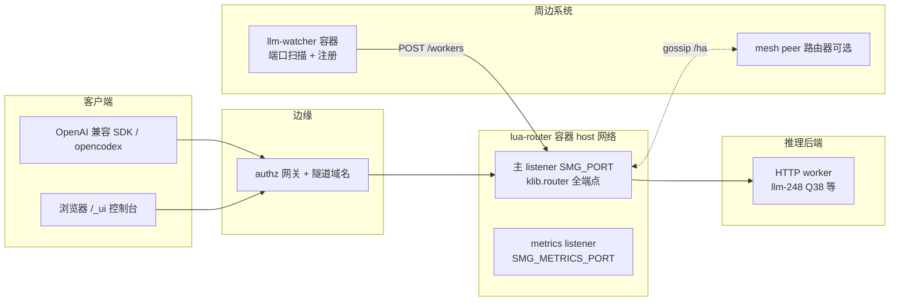
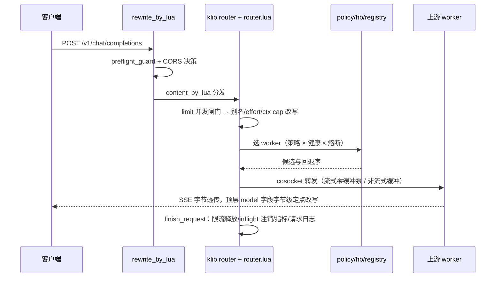

# lua-router 系统架构与代码框架

> 本文是独立仓库的架构总览：运行时模型、请求生命周期、模块地图、共享状态、策略子系统、
> 周边集成、部署形态与测试框架。计数对应 scope-trim 裁剪后的 main 树（2026-10-01 执行完毕：
> 19 个 Lua 模块 / 15 837 行、5 个单测文件、契约 580 项 / 22 段、15 门禁全绿，`router.lua` md5
> `0d35b0b8…`）。裁剪判定与执行记录见 [scope-trim.md](scope-trim.md)；已删平面（gRPC/PD、history、
> tokenizer/parse、auth、K8s discovery、OTel）的描述保留在 git 历史，本文只描述现状。

日期：2026-10-01（UTC）；scope-trim 裁剪后刷新。

## 0. 定位与全景

lua-router 是 Rust 网关 smg（源码在上游 llm-router 仓库的 gateway/）的 **OpenResty/Lua 等价重写**：
一个面向 LLM 推理后端的路由网关，负责多 worker 选路、流式透传、健康检查、熔断、并发限流、
观测与控制面。它跑在 authz 同源镜像（OpenResty 1.31 + LuaJIT）上，不依赖任何原生扩展，
与 authz 网关共享同一基础镜像生态。对外行为以 Rust 版为契约基准（27 段 wire 契约 841 项对拍）。

## 1. 运行时模型

### 1.1 进程模型与 worker 数

- OpenResty master + N worker（`NGINX_WORKER_PROCESSES`，缺省 auto）。
- **两个例外把 worker 钉成 1**：cache_aware 策略（一致性树是 per-process 表，多 worker 会把亲和率
  1.000 摊薄到 0.625）与 mesh 开启（成员表在进程内存里）。entrypoint 在这两种形态且未显式给
  worker 数时自动收敛，运维显式覆盖会得到文档化的衰减行为。
- 多 worker 下其余功能全部正确：所有跨请求状态都放共享字典（§6），per-process 的只有 cache_aware
  树、bucket 计数表和 mesh 成员快照。

### 1.2 监听面

| 监听 | 开关 | 缺省 | 内容 |
|---|---|---|---|
| 主 listener | `SMG_PORT` | 30000 | 全部 HTTP 端点：推理/控制/公开/_ui/ha；TLS 由 `SMG_TLS_CERT_PATH`+`SMG_TLS_KEY_PATH` 就地加密（替换明文监听，与 Rust rustls 同形） |
| metrics | `SMG_METRICS_PORT` | 29000 | 只出 `/metrics`（真实 Prometheus 文本）+ `/health`；其余路径干净 404（对齐 Rust 独立 prometheus listener） |

### 1.3 配置渲染

`docker-entrypoint.sh` 是唯一的启动路径：校验 env → envsubst 渲染 `conf/nginx.conf.template` →
`openresty -t` 构建期/启动期双语法门 → exec。渲染注入点：

| 变量 | 作用 |
|---|---|
| `${METRICS_EXTRA} / ${TLS_SERVER_EXTRA}` | 可选监听整块 |
| `LR_HTTP_INCLUDE / LR_SERVER_INCLUDE / LR_UI_CONF` | 运维追加 http/server 片段与 UI 路由（`off` 关闭） |
| `AUTHZ_DNS_RESOLVER` | 域名 worker 的 resolver 指令 |

env 命名三层双认：`SMG_*`（Rust CLI 同名语义）、`LMR_*`（UI agent 生态）、`LR_*`（测试专用），
entrypoint 在 init_by_lua 快照环境前完成归一（如 `SMG_UI_DIR`→`LMR_UI_DIR`）。

### 1.4 镜像与静态资产

`FROM authz:latest`；构建期 COPY 全部 lualib/模板/entrypoint/ui.conf，并把 vendored `ui/`（SvelteKit
静态包）放进 `/usr/local/share/llama-ui`；构建期跑一次 `openresty -t`，坏配置进不了镜像。
mime.types 在 http 块 include（含 webmanifest/mjs 补充映射），/_ui 静态文件按正确 Content-Type 发出。

## 2. 请求生命周期（HTTP 推理面）

关键不变量：

- **推理体字节透传**：除顶层 `model` 等受管字段用 `set_top_field` 精确扫描替换（不整表重编码，
  嵌套字段不受影响、数组保形），其余字节原样进出；流式响应不缓冲。
- **重试只在 Lua 层**：换 worker 重试、退避与 jitter、每 attempt 独立 cosocket；熔断计数在共享
  字典原子完成（跨 worker 进程一致）。
- **`/v1/responses` 纯透传**：会话存储平面已按 scope-trim 删除，该端点只做选路与转发。
- **log 阶段兜底**：客户端中途消失时唯一还会执行的是 `log_by_lua`，inflight 注销在这里兜底。

## 3. 模块地图

全部在 `lualib/resty/luarouter/`，单测对应 `test/unit/test_*.lua`（12 个文件，luajit 与 resty 双口径）。

| 模块 | 行数 | 职责 | 被谁接线 |
|---|---:|---|---|
| router.lua | 3208 | 入口与总装：路由表、转发泵、重试、/_ui 处理、metrics handler、DP rank 注入 | init.lua / 各 conf 的 *_by_lua |
| init.lua | 654 | fork 前接线：env 快照、模块 wire（history_redis/otel/mesh/discovery/limit/inflight 采样器）、on_log 兜底 | nginx init_by_lua |
| registry.lua | 1683 | worker 注册表（shdict 持久）、健康状态、/model_info 元数据发现、DP 展开 url@rank（决策函数内联自主） | router/hb/mesh |
| hb.lua | 374 | 健康巡检定时器 + 熔断计数（原子跨进程） | init 定时器 |
| policy.lua | 743 | 策略分发（random/round_robin/power_of_two/manual 简单策略内联于此）、policy hint、cache_aware 逃逸/快照 | router |
| policies/*.lua | ~2400 | 8 种策略实现：tree(基数树+粘滞)/cache_aware/bucket/consistent_hashing/prefix_hash/random/round_robin/power_of_two/manual | policy |
| hash.lua | 964 | BLAKE3 环位（与 Rust 逐位兼容）、ketama 序、粘滞键 | consistent_hashing/prefix_hash |
| config.lua / config_store.lua | 355/1290 | env→配置对象；运行时配置文件（LMR_CONFIG_FILE）与热快照 | 全模块 |
| limit.lua | 209 | 全局并发闸门 + 排队（shdict 计数） | router access |
| observability.lua | 1340 | Prometheus 家族渲染（HELP/TYPE 对齐 Rust）、请求日志环形缓冲、inflight 年龄槽表 | router/metrics handler |
| mesh.lua | 2525 | HA gossip：成员表、快照同步、/ha/* 端点、身份统一（sync_with 并键）、suspect/down 状态机 | init 定时器 |
| ui.lua / props.lua | 381/225 | /_ui API 别名与鉴权、/props 快照 | ui.conf include |

依赖方向自上而下单向：conf → init → router →（policy/registry/hb/limit/history/otel/…）→ policies。
除 mesh 成员表与 cache_aware 树外，模块间不共享进程内可变状态，跨请求状态一律走 shdict。

## 4. 平面清单（主 listener 端点域）

| 平面 | 端点 | 鉴权 |
|---|---|---|
| 推理数据面 | /v1/chat/completions、/v1/completions、/v1/embeddings、/v1/rerank、/v1/responses（纯透传）、/generate、/v1/models（HEAD 镜像） | 开放 |
| 控制面 | /workers CRUD（幂等 id）、/flush_cache、/v1/loads | 开放（信任边界=网络，见 §7 authz 边缘） |
| 公开面 | /health、/readiness、/version 类 | 无 |
| UI 面 | /_ui/*（API 别名 + SvelteKit 静态包 + SSE 日志流） | 与对应业务面同源 |
| HA | /ha/health、/ha/status、/ha/workers、/ha/policies、/ha/shutdown、/_mesh/internal/* | 缺省整面 503，SMG_MESH 开启后 loopback+key |
| 观测 | /metrics（metrics listener）、smg_* 47 家族 | 无 |
| 未实现 | /wasm 三条固定 501；postgres/oracle history 501 | — |

## 5. 共享状态（7 个 shdict）

| 字典 | 大小 | 内容 | 写者 |
|---|---|---|---|
| lr_workers | 2m | worker 记录（URL/模型/健康/熔断/元数据），registry 每次读写整表 JSON | registry/hb/discovery/mesh |
| lr_policy | 20m | 策略态：manual 粘滞键、routing key 计数 | policy |
| lr_stats | 5m | 计数器/直方图/inflight 年龄槽表（1024 定长槽） | observability |
| lr_request_log | 20m | 请求日志环形缓冲（/_ui/logs 与 SSE 源） | router log 阶段 |
| lr_limit | — | 全局并发闸门计数 | limit |
| lr_locks | — | 跨进程互斥（巡检/采样定时器的单飞锁） | init/hb |
| luarouter_config | — | config_store 热配置快照 | config_store |

一致性代价与收益：跨进程原子（熔断/限流/注册表）换每请求 shdict 往返；当前每请求 shdict 往返
66 次（出厂形态 44 次）是非流式 CPU 回退的主因（见 parity-cpu-ablation.md，P1+P2 ≈45–65%）。

## 6. 策略子系统

选择流：`router.route_inference` → `policy.select(policy_name, ctx)` → 策略实现从 registry 候选里
挑目标；`hb` 先过滤不健康/熔断中的 worker；失败回退序在 router 层（重试换 worker）。

| 策略 | 语义要点 | 与 Rust 对拍结论 |
|---|---|---|
| cache_aware（缺省） | 前缀亲和一致性树 + 负载逃逸（abs/rel 阈值）+ 快照驱逐 | 亲和/逃逸方向对齐；多 worker 亲和率衰减两侧同源 |
| consistent_hashing | BLAKE3 环位逐位兼容，摘节点 unchanged/collateral 比例一致 | 逐 key 落点完全相同 |
| prefix_hash | 对话前缀哈希粘滞，前缀截断、摘除恢复回原落点 | Rust HTTP 面 tokens 恒 None → 恒 503（Rust 侧缺陷），Lua 单边不变量钉住 |
| bucket | 环分段均衡，失衡改选最小桶，gap=floor(4096/N) | Rust CLI 拒绝该策略；多进程下失衡保护被摊薄（已钉测试） |
| power_of_two | 双随机候选取低载 | Rust 无 /v1/loads 时退化为随机（Rust 侧缺陷），Lua 用自身 inflight |
| random / round_robin / manual | 均匀（χ² 双检）/顺序/粘滞绑定+回切 | 一致 |

per-model policy hint：worker 注册元数据可携带策略提示（`metadata.policy`），`policy_for` 按
模型解析——这是 P2 CPU 项的来源之一（见 parity-cpu-ablation.md）。

## 7. 周边集成

| 系统 | 方向 | 机制与注意 |
|---|---|---|
| llm-watcher | watcher→router | 容器常驻（LLM_WATCHER_ROUTER 指向主端口），端口扫描/proc 扫描/docker 事件发现本机模型服务，POST /workers 注册，账本周期对账（remove grace 300s）。**注意**：它会把任何应答 OpenAI /v1/models 的本机端口当 worker——在本机跑 e2e 测试时 mock（alpha/beta）会短暂进入生产池，测试后由对账清除；根治需要 watcher 侧黑名单 |
| mesh peer | router↔router | SMG_MESH_PEERS 种子 + gossip 同步 worker 视图；SELF/PEERS 写法不一致时由 sync_with 身份统一并键（幻影键已修，mesh_two 门钉住） |
| authz 边缘 | client→router | 生产经隧道域名时 authz 闸门加会话登录或 x-api-key；与网关本身无关 |

## 8. DP（data parallel）展开面（HTTP）

多 GPU 后端（dp_size>1）由 registry 展开成 `<base>@<rank>` 候选：`expansion_plan` 等纯决策函数
在 registry 内联（原属 discovery 模块，裁剪时迁移）；`router.find_top_member`/`inject_dp_rank` 在
转发前往请求体写 `data_parallel_rank`。`/server_info` 拉取失败不展开、单 rank 撤收、交叉组 4 rank
等 31 项断言在 e2e_stateful（91 项）里。原 gRPC/PD 分离面（grpc_proxy/pd/proto body 注入）已按
scope-trim 删除，git 历史可恢复。

## 9. 部署形态

| 项 | 值 |
|---|---|
| 镜像 | 本仓构建 `lua-router:latest` / 生产 tag `lua-router:8800-20261001`（FROM authz:latest） |
| 编排 | /data/app/lua-router/docker-compose.yml：host 网络、unless-stopped、env 映射 Rust CLI 参数 |
| 生产实例 | 235.t 容器 lua-router-8800，主端口 8800，metrics 29000；切换窗口 0.78s |
| 回滚 | docker stop lua-router-8800 && docker start llm-router-8800（Rust 容器已停保留） |
| Redis 门禁 | test/local.env（gitignored）提供 LUA_TEST_REDIS_HOST/PASSWORD |
| 已知运维点 | 8012/8013 种子后端当前无监听（Rust 时代同样）；watcher 端口扫描会把测试 mock 短暂注册进生产池 |

## 10. 测试与质量框架

`test/final_gates.sh` 是唯一入口（SKIP_ENV/GATE_ONLY/KEEP_GOING，串行硬门，**不可并发**——host 网络
+ 固定容器名前缀会争用）：

| 门 | 覆盖 | 门 | 覆盖 |
|---|---|---|---|
| build | 镜像构建+conf 语法门 | head_routes | HEAD 镜像 108 |
| conf | 两份 conf -t | mesh_http | mesh 真实 HTTP 47 |
| unit | 5 单测文件双口径（tree/hash/policies/integration/mesh） | e2e_policy_parity | 四策略与 Rust 量化对拍 47 |
| contract | 22 段 wire 契约 580 项 | mesh_two | 双真节点收敛/分区/retire 37 |
| probes | 25 项工厂/旋钮探针 | e2e_tls_chain | 证书链/负例/SNI 112 |
| e2e_stateful | 有状态策略+responses 透传+DP 展开 91 | e2e_errors / e2e_effort | 错误契约 10 / effort 4 |
| e2e_policies | 策略真流量 65 | e2e_ui_bridge | /_ui 改写一致+MIME 25 |

方法论：契约=与 Rust 实例同请求逐字段对拍；策略=分布统计（χ²）+不变量+变异验证；e2e=真容器真
上游。对拍原始报告在 doc/parity-*.md 与 doc/real-eval.md（真实上游 18/18、prefix cache 命中 97–99%）。

## 11. 与 Rust 原版的关系（档位口径，裁剪后）

- **A 已等价（新范围内）**：推理/控制/公开/UI/观测/HA(mesh) 有契约或 e2e 钉死；gRPC、history、tokenizer/parse、auth、K8s discovery、OTel 六个平面已按 scope-trim 删除（git 历史可恢复）。
- **B 有意偏差**：上游证书不校验、gRPC 无 nginx 层重试、无 h2 连接复用、metrics 合并的 Rust quirk
  照抄等（feature-gap §4 全表）。
- **C 待行动**：非流式 CPU 回退修复（已定责 P1+P2）、TLS 入口预检（配对/缺中间证书）、mTLS、
  Redis 可达性耦合。
- **D 用户指示 TODO（不实现）**：MCP、wasm、Postgres/Oracle history（唯一口径 todo-deferred.md）。

## 12. 演进索引

| 方向 | 入口文档 |
|---|---|
| CPU 回退修复（R0 重测→按嫌疑榜消融） | [parity-cpu-ablation.md](parity-cpu-ablation.md) §8 |
| TLS 入口预检路线 | [gap-tls-chain.md](gap-tls-chain.md) §5/§6 |
| 已删平面的恢复 | git revert 对应 trim(stepN) commit；设计记录在 gap-grpc-proto.md 等历史文档 |
| watcher 测试 mock 污染治理 | 本文件 §7（需 watcher 侧改造） |

